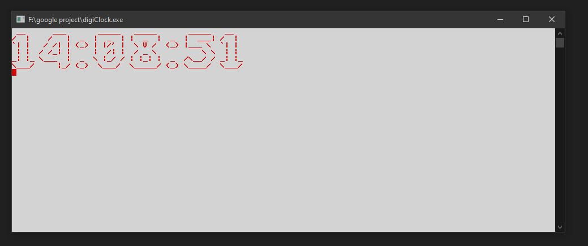

# Digital Clock with ASCII Art

## Table of Contents

- [Introduction](#introduction)
- [Features](#features)
- [Prerequisites](#prerequisites)
- [Usage](#usage)
- [Project Structure](#project-structure)
- [How It Works](#how-it-works)
- [Customization](#customization)
- [Contributing](#contributing)
- [License](#license)
- [Acknowledgments](#acknowledgments)

## Introduction

Welcome to the Digital Clock project! This C++ program displays a digital clock in the console using ASCII art. It's a fun and educational project that demonstrates how to work with time, ASCII art, and console manipulation in C++.



## Features

- Displays the current time in HH:MM:SS format.
- Updates the time every second.
- Utilizes ASCII art for visually appealing digit display.
- Cross-platform compatibility.

## Prerequisites

Before you begin, ensure you have met the following requirements:

- **C++ Compiler**: You need a C++ compiler to build and run the project.
- **Git** (optional): If you want to clone the repository.

## Usage

Follow these steps to compile and run the Digital Clock:

1. Clone the repository to your local machine (if you haven't already):

```bash
git clone https://github.com/yourusername/DigitalClock.git
```
   
2. Navigate to the project directory:

```bash
cd DigitalClock
```

3. Compile the program:

```bash
g++ main.cpp -o digital_clock
```
You can use any C++ compiler you prefer.

4. Run the program:

```bash
./digital_clock
```
The digital clock will start displaying the time in your console.


## Project Structure


The project structure is organized as follows:

- **main.cpp**: Contains the main program logic.
- **README.md**: This file, providing project information.
- **screenshots/**: Directory containing screenshots or images.
- **LICENSE**: The project's license file.


## How It Works


The Digital Clock program uses the following key components:

- C++ Standard Library: To manage time and create the ASCII art representation of digits.
- <chrono>: For time-related operations and updating the clock every second.
- <thread>: To pause execution and update the clock's display.
- ASCII Art: Custom ASCII art representations for digits and colons.
- The program gets the current system time, converts it into a tm structure, and then formats and displays it using ASCII art for each digit.


## Customization


You can customize the appearance of the ASCII art digits or add additional features to the Digital Clock to make it your own. Feel free to explore and modify the code to suit your preferences.


## Contributing


Contributions are welcome! If you have any improvements or feature additions in mind, please follow these steps:
- Fork the repository.
- Create a new branch for your feature (git checkout -b feature/your-feature-name).
- Make your changes and commit them (git commit -m "Add your feature").
- Push the changes to your forked repository (git push origin feature/your-feature-name).
- Create a pull request on the original repository.


## License


This project is licensed under the MIT License - see the LICENSE file for details.


## Acknowledgments

ASCII art for digits created by [Ankur Gupta](https://github.com/Ankur-Kumar-Gupta/).
